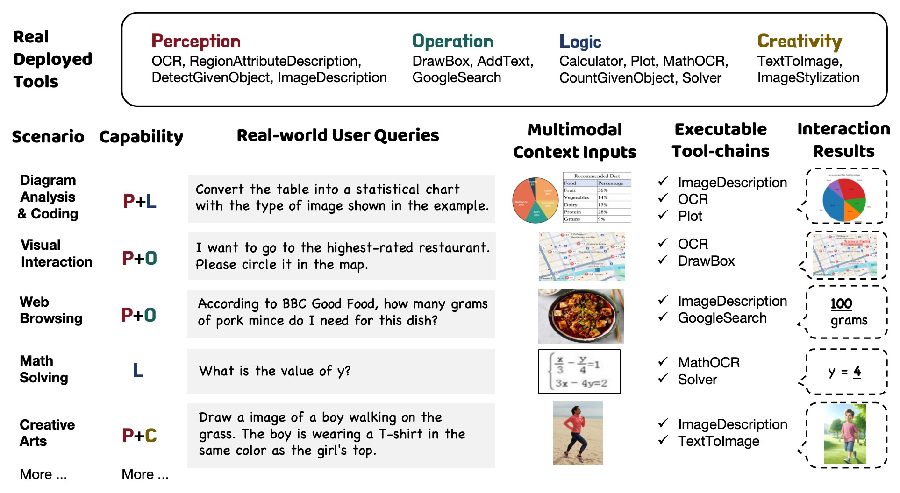
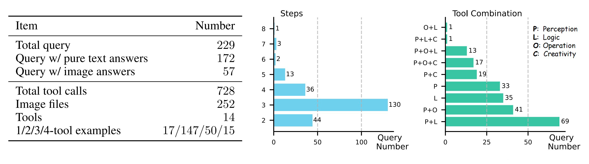

# GTA: A Benchmark for General Tool Agents

<!-- <div align="center">


  <div> </div>
    <b><font size="3">MathBench</font></b>
    <div> 
  </div>
</div> -->


<div align="center">

[📃 [Paper](https://xxx)]
[🌐 [Project Page](https://xxx)]
[🤗 [Hugging Face](https://xxx)]
[📌 [License](https://xxx)]
</div>

## 🌟 Introduction

GTA is a benchmark to evaluate the tool-use capability of LLM-based agents in real-world scenarios. It features three main aspects:
- **Real user queries.** The benchmark contains 229 human-written queries with simple real-world objectives but implicit tool-use, requiring the LLM to reason the suitable tools and plan the solution steps. 
- **Real deployed tools.** an evaluation platform equipped with tools across perception, operation, logic, and creativity categories to evaluate the agents' actual task execution performance.
- **Real multimodal inputs.** authentic image files, such as spatial scenes, web page screenshots, tables, code snippets, and printed/handwritten materials, used as the query contexts to align with real-world scenarios closely.
<div align="center">
 
</div>

## 📣 What's New

- **[2024.x.xx]** Paper available on Arxiv. ✨✨✨
- **[2024.x.xx]** Release the evaluation and tool deployment code of GTA. 🔥🔥🔥
- **[2024.x.xx]** Release the GTA dataset on Hugging Face and OpenDataLab. 🎉🎉🎉

## 📚 Dataset Statistics
GTA comprises a total of 229 questions. The basic dataset statistics is presented below. 

<div align="center">
 
</div>

## 🏆 Leader Board

We evaluate the language models in two modes:
- **Step-by-step mode.** It is designed to evaluate the model's fine-grained tool-use capabilities. In this mode, the model is provided with the initial $n$ steps of the reference tool chain as prompts, with the expectation to predict the action in step $n+1$. Four metrics are devised under step-by-step mode: ***InstAcc*** (instruction following accuracy), ***ToolAcc*** (tool selection accuracy), ***ArgAcc*** (argument prediction accuracy), and ***SummAcc*** (answer summarizing accuracy).

- **End-to-end mode.** It is designed to reflect the tool agent's actual task executing performance. In this mode, the model actually calls the tools and solves the problem by itself. We use ***AnsAcc*** (final answer accuracy) to measure the accuracy of the execution result. Besides, we calculate four ***F1 scores of tool selection: P, L, O, C*** in perception, operation, logic, and creativity categories, to measure the tool selection capability. 

Here is the performance of various LLMs on GTA. Inst, Tool, Arg, Summ, and Ans denote InstAcc, ToolAcc, ArgAcc SummAcc, and AnsAcc, respectively. P, O, L, C denote the F1 score of tool selection in Perception, Operation, Logic, and Creativity categories. ***Bold*** denotes the best score among all models. <u>*Underline*</u> denotes the best score under the same model scale. ***AnsAcc*** reflects the overall performance.

**Models** | **Inst** | **Tool** | **Arg** | **Summ** | **P** | **O** | **L** | **C** | **Ans**
---|---|---|---|---|---|---|---|---|---
💛 ***API-based*** | | | | | | | | |
gpt-4-1106-preview | 85.19 | 61.4 | <u>**37.88**</u> | 75 | 67.61 | 64.61 | 74.73 |89.55 |  <u>**46.59**</u>
gpt-4o | <u>**86.42**</u> | <u>**70.38**</u> | 35.19 | 72.77 | <u>**75.56**</u> | <u>**80**</u> | <u>**78.75**</u> | 82.35 | 41.52
gpt-3.5-turbo | 67.63 | 42.91 | 20.83 | 60.24 | 58.99 | 62.5 | 59.85 | <u>**97.3**</u> | 23.62
claude3-opus |64.75 | 54.4 | 17.59 | <u>**73.81**</u> | 41.69 | 63.23 | 46.41 | 42.1 | 23.44
mistral-large | 58.98 | 38.42 | 11.13 | 68.03 | 19.17 | 30.05 | 26.85 | 38.89 | 17.06 
💚 ***Open-source*** | | | | | | | | |
qwen1.5-72b-chat | <u>48.83</u> | 24.96 | <u>7.9</u> | 68.7 | 12.41 | 11.76 | 21.16 | 5.13 | <u>13.32</u>
qwen1.5-14b-chat | 42.25 | 18.85 | 6.28 | 60.06 | 19.93 | 23.4 | <u>39.83</u> | 25.45 | 12.42
qwen1.5-7b-chat | 29.77 | 7.36 | 0.18 | 49.38 | 0 | 13.95 | 16.22 | 36 | 10.56
mixtral-8x7b-instruct | 28.67 | 12.03 | 0.36 | 54.21 | 2.19 | <u>34.69</u> | 37.68 | 42.55 | 9.77
deepseek-llm-67b-chat | 9.05 | 23.34 | 0.18 | 11.51 | 14.72 | 23.19 | 22.22 | 27.42 | 9.51
llama3-70b-instruct | 47.6 | <u>36.8</u> | 4.31 | <u>69.06</u> | <u>32.37</u> | 22.37 | 36.48 | 31.86 | 8.32
mistral-7b-instruct | 26.75 | 10.05 | 0 | 51.06 | 13.75 | 33.66 | 35.58 | 31.11 | 7.37
deepseek-llm-7b-chat | 10.56 | 16.16 | 0.18 | 18.27 | 20.81 | 15.22 | 31.3 | 37.29 | 4
yi-34b-chat | 23.23 | 10.77 | 0 | 34.99 | 11.6 | 11.76 | 12.97 | 5.13 | 3.21
llama3-8b-instruct | 45.95 | 11.31 | 0 | 36.88 | 19.07 | 23.23 | 29.83 | <u>42.86</u> | 3.1
yi-6b-chat | 21.26 | 14.72 | 0 | 32.54 | 1.47 | 0 | 1.18 | 0 | 0.58


## 🚀 Get Started
[OpenCompass](https://github.com/open-compass/opencompass) is a toolkit for evaluating the performance of large language models (LLMs). There are steps for inference MathBench with OpenCompass:
1. Install OpenCompass
```
conda create --name opencompass python=3.10 pytorch torchvision pytorch-cuda -c nvidia -c pytorch -y
conda activate opencompass
git clone https://github.com/open-compass/opencompass opencompass
cd opencompass
pip install -e .
```
2. Prepare the dataset, you can download the data from [release file](https://github.com/open-compass/MathBench/releases/tag/v0.1.0)
```
# Download dataset from release file and copy to data/ folder
mkdir data
cp -rf mathbench_v1 ./data/ 
```
3. Inference MathBench
```
# Inference MathBench with hf_llama2_7b_chat model
python run.py --models hf_llama2_7b_chat --datasets mathbench_gen
```
You can also evaluate HuggingFace models via command line. 
```
python run.py --datasets mathbench_gen \
--hf-path meta-llama/Llama-2-7b-chat-hf \  # HuggingFace model path
--model-kwargs device_map='auto' \  # Arguments for model construction
--tokenizer-kwargs padding_side='left' truncation='left' use_fast=False \  # Arguments for tokenizer construction
--max-seq-len 2048 \  # Maximum sequence length the model can accept
--batch-size 8 \  # Batch size
--no-batch-padding \  # Don't enable batch padding, infer through for loop to avoid performance loss
--num-gpus 1  # Number of minimum required GPUs
--summarizer summarizers.mathbench_v1 # Summarizer for MathBench
```


# 📝 Citation
If you use GTA in your research, please cite the following paper:
```
@misc{xxx,
      title={GTA: A Benchmark for General Tool Agents}, 
      author={xxx},
      year={2024},
      eprint={xxx},
      archivePrefix={arXiv},
      primaryClass={cs.CL}
}
```
