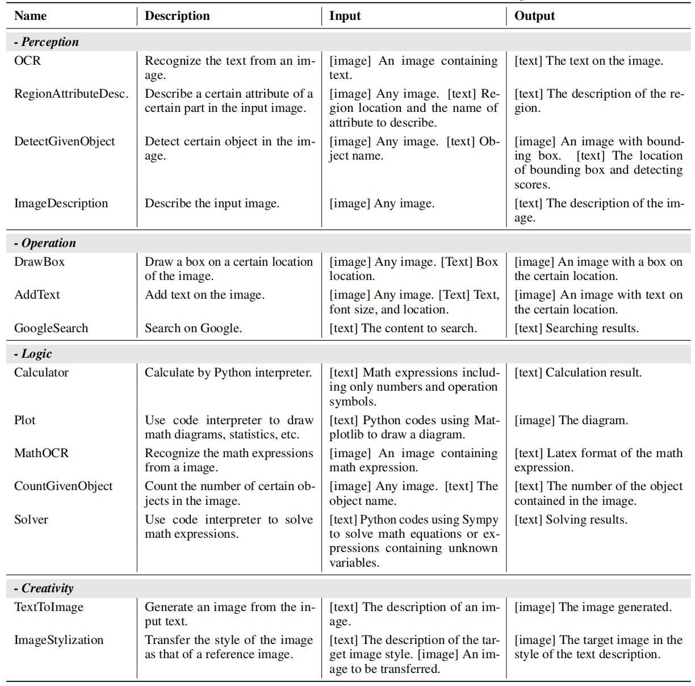

# GTA: A Benchmark for General Tool Agents

<div align="center">

[⬇️ [Dataset](https://github.com/open-compass/GTA/releases/download/v0.1.0/gta_dataset.zip)]
[📃 [Paper](https://arxiv.org/abs/2407.08713)]
[🌐 [Project Page](https://open-compass.github.io/GTA/)]
[🤗 [Hugging Face](https://huggingface.co/datasets/Jize1/GTA)]
[🏆 [Newest Leaderboard](#-leaderboard-mar-2025)]
</div>

## 🌟 Introduction

>In developing general-purpose agents, significant focus has been placed on integrating large language models (LLMs) with various tools. This poses a challenge to the tool-use capabilities of LLMs. However, there are evident gaps between existing tool evaluations and real-world scenarios. Current evaluations often use AI-generated queries, single-step tasks, dummy tools, and text-only inputs, which fail to reveal the agents' real-world problem-solving abilities effectively. 

GTA is a benchmark to evaluate the tool-use capability of LLM-based agents in real-world scenarios. It features three main aspects:
- **Real user queries.** The benchmark contains 229 human-written queries with simple real-world objectives but implicit tool-use, requiring the LLM to reason the suitable tools and plan the solution steps. 
- **Real deployed tools.** GTA provides an evaluation platform equipped with tools across perception, operation, logic, and creativity categories to evaluate the agents' actual task execution performance.
- **Real multimodal inputs.** Each query is attached with authentic image files, such as spatial scenes, web page screenshots, tables, code snippets, and printed/handwritten materials, used as the query contexts to align with real-world scenarios closely.
<div align="center">
 
</div>

The comparison of GTA queries with AI-generated queries is shown in the table below. The steps and tool types for queries in ToolBench and m\&m's are explicitly stated, as marked in red and blue. The queries in APIBench are simple, only containing one step. Our GTA's queries are both step-implicit and tool-implicit.
<div align="center">
 
</div>

## 📣 What's New

- **[2025.3.25]** Update 🏆Leaderboard, Mar. 2025, including new models such as Deepseek-R1, Deepseek-V3, Qwen-QwQ, Qwen-2.5-max series.
- **[2024.9.26]** GTA is accepted to NeurIPS 2024 Dataset and Benchmark Track! 🎉🎉🎉
- **[2024.7.11]** Paper available on arXiv. ✨✨✨
- **[2024.7.3]** Release the evaluation and tool deployment code of GTA. 🔥🔥🔥
- **[2024.7.1]** Release the GTA dataset on Hugging Face. 🎉🎉🎉

## 📚 Dataset Statistics
GTA comprises a total of 229 questions. The basic dataset statistics is presented below.  The number of tools involved in each question varies from 1 to 4. The steps to resolve the questions range from 2 to 8.

<div align="center">
 
</div>

The detailed information of 14 tools are shown in the table below.

<div align="center">
 
</div>

## 🏆 Leaderboard, July 2024

We evaluate the language models in two modes:
- **Step-by-step mode.** It is designed to evaluate the model's fine-grained tool-use capabilities. In this mode, the model is provided with the initial $n$ steps of the reference tool chain as prompts, with the expectation to predict the action in step $n+1$. Four metrics are devised under step-by-step mode: ***InstAcc*** (instruction following accuracy), ***ToolAcc*** (tool selection accuracy), ***ArgAcc*** (argument prediction accuracy), and ***SummAcc*** (answer summarizing accuracy).

- **End-to-end mode.** It is designed to reflect the tool agent's actual task executing performance. In this mode, the model actually calls the tools and solves the problem by itself. We use ***AnsAcc*** (final answer accuracy) to measure the accuracy of the execution result. Besides, we calculate four ***F1 scores of tool selection: P, L, O, C*** in perception, operation, logic, and creativity categories, to measure the tool selection capability. 

Here is the performance of various LLMs on GTA. Inst, Tool, Arg, Summ, and Ans denote InstAcc, ToolAcc, ArgAcc SummAcc, and AnsAcc, respectively. P, O, L, C denote the F1 score of tool selection in Perception, Operation, Logic, and Creativity categories. ***Bold*** denotes the best score among all models. <ins>*Underline*</ins> denotes the best score under the same model scale. ***AnsAcc*** reflects the overall performance.

**Models** | **Inst** | **Tool** | **Arg** | **Summ** | **P** | **O** | **L** | **C** | **Ans** | **Ans+I**
---|---|---|---|---|---|---|---|---|---|---
💛 ***API-based*** | | | | | | | | | |
gpt-4-1106-preview | 85.19 | 61.4 | <ins>**37.88**</ins> | <ins>**75**</ins> | 67.61 | 64.61 | 74.73 |89.55 |  <ins>**46.59**</ins> | <ins>**44.9**</ins>
gpt-4o | <ins>**86.42**</ins> | <ins>**70.38**</ins> | 35.19 | 72.77 | <ins>**75.56**</ins> | <ins>**80**</ins> | <ins>**78.75**</ins> | 82.35 | 41.52 | 40.05
gpt-3.5-turbo | 67.63 | 42.91 | 20.83 | 60.24 | 58.99 | 62.5 | 59.85 | <ins>**97.3**</ins> | 23.62 | 21.18
claude3-opus |64.75 | 54.4 | 17.59 | 73.81 | 41.69 | 63.23 | 46.41 | 42.1 | 23.44 | 14.47
mistral-large | 58.98 | 38.42 | 11.13 | 68.03 | 19.17 | 30.05 | 26.85 | 38.89 | 17.06 | 11.94
💚 ***Open-source*** | | | | | | | | | |
qwen1.5-72b-chat | <ins>48.83</ins> | 24.96 | <ins>7.9</ins> | 68.7 | 12.41 | 11.76 | 21.16 | 5.13 | <ins>13.32</ins> | <ins>10.22</ins>
qwen1.5-14b-chat | 42.25 | 18.85 | 6.28 | 60.06 | 19.93 | 23.4 | <ins>39.83</ins> | 25.45 | 12.42 | 9.33
qwen1.5-7b-chat | 29.77 | 7.36 | 0.18 | 49.38 | 0 | 13.95 | 16.22 | 36 | 10.56 | 7.93
mixtral-8x7b-instruct | 28.67 | 12.03 | 0.36 | 54.21 | 2.19 | <ins>34.69</ins> | 37.68 | 42.55 | 9.77 | 9.33
deepseek-llm-67b-chat | 9.05 | 23.34 | 0.18 | 11.51 | 14.72 | 23.19 | 22.22 | 27.42 | 9.51 | 7.93
llama3-70b-instruct | 47.6 | <ins>36.8</ins> | 4.31 | <ins>69.06</ins> | <ins>32.37</ins> | 22.37 | 36.48 | 31.86 | 8.32 | 6.25
mistral-7b-instruct | 26.75 | 10.05 | 0 | 51.06 | 13.75 | 33.66 | 35.58 | 31.11 | 7.37 | 5.54
deepseek-llm-7b-chat | 10.56 | 16.16 | 0.18 | 18.27 | 20.81 | 15.22 | 31.3 | 37.29 | 4 | 3.01
yi-34b-chat | 23.23 | 10.77 | 0 | 34.99 | 11.6 | 11.76 | 12.97 | 5.13 | 3.21 | 2.41
llama3-8b-instruct | 45.95 | 11.31 | 0 | 36.88 | 19.07 | 23.23 | 29.83 | <ins>42.86</ins> | 3.1 | 2.74
yi-6b-chat | 21.26 | 14.72 | 0 | 32.54 | 1.47 | 0 | 1.18 | 0 | 0.58 | 0.44


## 🏆 Leaderboard, Mar. 2025

**Models** | **Inst** | **Tool** | **Arg** | **Summ** | **P** | **O** | **L** | **C** | **Ans** | **Ans+I**
---|---|---|---|---|---|---|---|---|---|---
💛 ***API-based*** | | | | | | | | | |
deepseek-v3 | 68.31 | 40.57 | 25.49 | 66.05 | 70.81 | 73.28 | 77.70 | 86.15 | <ins>**44.78**</ins> | <ins>**49.67**</ins>
qwen-max-2.5 | 83.54 | 58.35 | 29.62 | 72.87 | 69.86 | 76.92 | 74.55 | <ins>**89.55**</ins> | 41.73 | 45.91
gpt-4o | <ins>**86.42**</ins> | <ins>**70.38**</ins> | <ins>**35.19**</ins> | 72.77 | <ins>**75.56**</ins> | <ins>**80**</ins> | <ins>**78.75**</ins> | 82.35 | 41.52 | 40.05
💚 ***Open-source*** | | | | | | | | | | |
qwq-32b | 27.02 | 13.82 | 0 | 47.5 | <ins>59.12</ins> | <ins>54.7</ins> | 44.35 | 45.61 | <ins>27.31</ins> | <ins>22.36</ins>
deepseek-r1-distill-llama-70b | 30.73 | 7.72 | 0.36 | 48.46 | 34.03 | 42.37 | 27.23 | 37.5 | 13.09 | 10.21
deepseek-r1-distill-llama-8b | 27.3 | 14.72 | 0 | 52.6 | 22.29 | 38.78 | 23.59 | 39.13 | 11.10 | 9.45
qwen2.5-7b-instruct | <ins>56.38</ins> | 32.85 | 5.57 | <ins>65.75</ins> | 20.67 | 29.17 | 20.83 | 45.83 | 9.06 | 8.95
llama-3.1-8b-instruct | 41.15 | 24.24 | 1.08 | 64.71 | 36.32 | 43.69 | 47.3 | 21.59 | 8.78 | 8.08
ministral-8b-instruct-2410 | 42.39 | 22.08 | 2.15 | 61.4 | 19.28 | 42.96 | <ins>49.59</ins> | <ins>58.06</ins> | 6.46 | 7.4
mistral-large-instruct-2411 | 50.89 | <ins>40.75</ins> | <ins>15.44</ins> | 60.74 | 22.41 | 30.77 | 33.77 | 30.77 | 7.35 | 6.99
llama-3.1-nemotron-70b-instruct-hf | 27.43 | 18.31 | 0 | 51.24 | 20.18 | 35.59 | 23.89 | 23.73 | 8.6 | 6.46


## 🚀 Evaluate on GTA

### Prepare GTA Dataset
1. Clone this repo.
```shell
git clone https://github.com/open-compass/GTA.git
cd GTA
```
2. Download the dataset from [release file](https://github.com/open-compass/GTA/releases/download/v0.1.0/gta_dataset.zip).
```shell
mkdir ./opencompass/data
```
Put it under the folder ```./opencompass/data/```. The structure of files should be:
```
GTA/
├── agentlego
├── opencompass
│   ├── data
│   │   ├── gta_dataset
│   ├── ...
├── ...
```

### Prepare Your Model
1. Download the model weights.
```shell
pip install -U huggingface_hub
# huggingface-cli download --resume-download hugging/face/repo/name --local-dir your/local/path --local-dir-use-symlinks False
huggingface-cli download --resume-download Qwen/Qwen1.5-7B-Chat --local-dir ~/models/qwen1.5-7b-chat --local-dir-use-symlinks False
```
2. Install [LMDeploy](https://github.com/InternLM/lmdeploy).
```shell
conda create -n lmdeploy python=3.10
conda activate lmdeploy
```
For CUDA 12:
```shell
pip install lmdeploy
```
For CUDA 11+:
```shell
export LMDEPLOY_VERSION=0.4.0
export PYTHON_VERSION=310
pip install https://github.com/InternLM/lmdeploy/releases/download/v${LMDEPLOY_VERSION}/lmdeploy-${LMDEPLOY_VERSION}+cu118-cp${PYTHON_VERSION}-cp${PYTHON_VERSION}-manylinux2014_x86_64.whl --extra-index-url https://download.pytorch.org/whl/cu118
```
3. Launch a model service.
```shell
# lmdeploy serve api_server path/to/your/model --server-port [port_number] --model-name [your_model_name]
lmdeploy serve api_server ~/models/qwen1.5-7b-chat --server-port 12580 --model-name qwen1.5-7b-chat
```
### Deploy Tools
1. Install [AgentLego](https://github.com/InternLM/agentlego).
```shell
conda create -n agentlego python=3.11.9
conda activate agentlego
cd agentlego
pip install -r requirements_all.txt
pip install agentlego
pip install -e .
mim install mmengine
mim install mmcv==2.1.0
```
Open ```~/anaconda3/envs/agentlego/lib/python3.11/site-packages/transformers/modeling_utils.py```, then set ```_supports_sdpa = False``` to ```_supports_sdpa = True``` in line 1279.

2. Deploy tools for GTA benchmark.

To use the GoogleSearch and MathOCR tools, you should first get the Serper API key from https://serper.dev, and the Mathpix API key from https://mathpix.com/. Then export these keys as environment variables.

```shell
export SERPER_API_KEY='your_serper_key_for_google_search_tool'
export MATHPIX_APP_ID='your_mathpix_key_for_mathocr_tool'
export MATHPIX_APP_KEY='your_mathpix_key_for_mathocr_tool'
```

Start the tool server.

```shell
agentlego-server start --port 16181 --extra ./benchmark.py  `cat benchmark_toollist.txt` --host 0.0.0.0
```
### Start Evaluation
1. Install [OpenCompass](https://github.com/open-compass/opencompass).
```shell
conda create --name opencompass python=3.10 pytorch torchvision pytorch-cuda -c nvidia -c pytorch -y
conda activate opencompass
cd agentlego
pip install -e .
cd ../opencompass
pip install -e .
```
huggingface_hub==0.25.2 (<0.26.0)
transformers==4.40.1
2. Modify the config file at ```configs/eval_gta_bench.py``` as below.

The ip and port number of **openai_api_base** is the ip of your model service and the port number you specified when using lmdeploy.

The ip and port number of **tool_server** is the ip of your tool service and the port number you specified when using agentlego.

```python
models = [
  dict(
        abbr='qwen1.5-7b-chat',
        type=LagentAgent,
        agent_type=ReAct,
        max_turn=10,
        llm=dict(
            type=OpenAI,
            path='qwen1.5-7b-chat',
            key='EMPTY',
            openai_api_base='http://10.140.1.17:12580/v1/chat/completions',
            query_per_second=1,
            max_seq_len=4096,
            stop='<|im_end|>',
        ),
        tool_server='http://10.140.0.138:16181',
        tool_meta='data/gta_dataset/toolmeta.json',
        batch_size=8,
    ),
]
```

If you infer and evaluate in **step-by-step** mode, you should comment out **tool_server** and enable **tool_meta** in ```configs/eval_gta_bench.py```, and set infer mode and eval mode to **every_with_gt** in ```configs/datasets/gta_bench.py```:
```python
models = [
  dict(
        abbr='qwen1.5-7b-chat',
        type=LagentAgent,
        agent_type=ReAct,
        max_turn=10,
        llm=dict(
            type=OpenAI,
            path='qwen1.5-7b-chat',
            key='EMPTY',
            openai_api_base='http://10.140.1.17:12580/v1/chat/completions',
            query_per_second=1,
            max_seq_len=4096,
            stop='<|im_end|>',
        ),
        # tool_server='http://10.140.0.138:16181',
        tool_meta='data/gta_dataset/toolmeta.json',
        batch_size=8,
    ),
]
```
```python
gta_bench_infer_cfg = dict(
    prompt_template=dict(
        type=PromptTemplate,
        template="""{questions}""",
    ),
    retriever=dict(type=ZeroRetriever),
    inferencer=dict(type=AgentInferencer, infer_mode='every_with_gt'),
)
gta_bench_eval_cfg = dict(evaluator=dict(type=GTABenchEvaluator, mode='every_with_gt'))
```

If you infer and evaluate in **end-to-end** mode, you should comment out **tool_meta** and enable **tool_server** in ```configs/eval_gta_bench.py```, and set infer mode and eval mode to **every** in ```configs/datasets/gta_bench.py```:
```python
models = [
  dict(
        abbr='qwen1.5-7b-chat',
        type=LagentAgent,
        agent_type=ReAct,
        max_turn=10,
        llm=dict(
            type=OpenAI,
            path='qwen1.5-7b-chat',
            key='EMPTY',
            openai_api_base='http://10.140.1.17:12580/v1/chat/completions',
            query_per_second=1,
            max_seq_len=4096,
            stop='<|im_end|>',
        ),
        tool_server='http://10.140.0.138:16181',
        # tool_meta='data/gta_dataset/toolmeta.json',
        batch_size=8,
    ),
]
```
```python
gta_bench_infer_cfg = dict(
    prompt_template=dict(
        type=PromptTemplate,
        template="""{questions}""",
    ),
    retriever=dict(type=ZeroRetriever),
    inferencer=dict(type=AgentInferencer, infer_mode='every'),
)
gta_bench_eval_cfg = dict(evaluator=dict(type=GTABenchEvaluator, mode='every'))
```

3. Infer and evaluate with OpenCompass.
```shell
# infer only
python run.py configs/eval_gta_bench.py --max-num-workers 32 --debug --mode infer
```
```shell
# evaluate only
# srun -p llmit -q auto python run.py configs/eval_gta_bench.py --max-num-workers 32 --debug --reuse [time_stamp_of_prediction_file] --mode eval
srun -p llmit -q auto python run.py configs/eval_gta_bench.py --max-num-workers 32 --debug --reuse 20240628_115514 --mode eval
```
```shell
# infer and evaluate
python run.py configs/eval_gta_bench.py -p llmit -q auto --max-num-workers 32 --debug
```


# 📝 Citation
If you use GTA in your research, please cite the following paper:
```bibtex
@misc{wang2024gtabenchmarkgeneraltool,
      title={GTA: A Benchmark for General Tool Agents}, 
      author={Jize Wang and Zerun Ma and Yining Li and Songyang Zhang and Cailian Chen and Kai Chen and Xinyi Le},
      year={2024},
      eprint={2407.08713},
      archivePrefix={arXiv},
      primaryClass={cs.CL},
      url={https://arxiv.org/abs/2407.08713}, 
}
```

