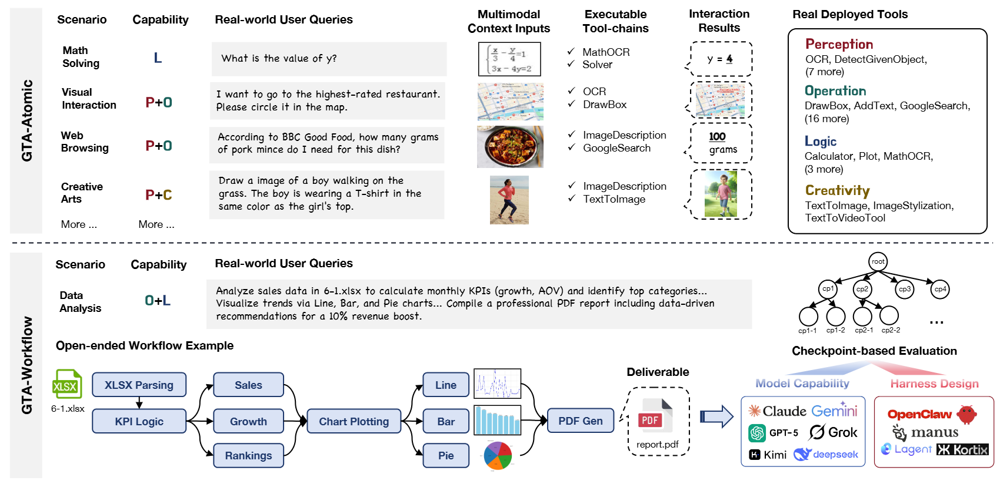
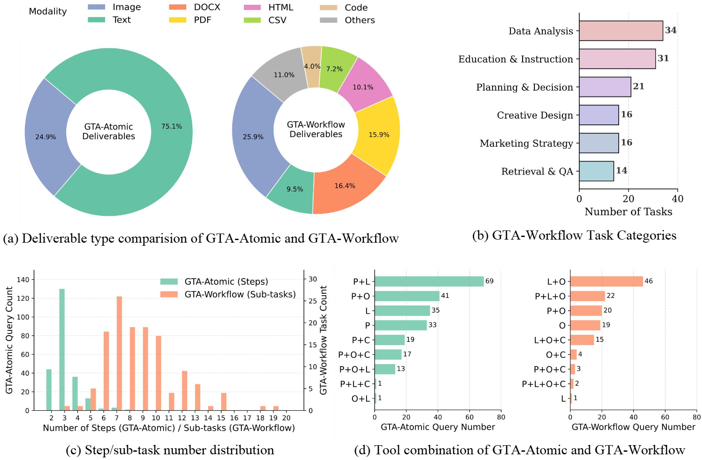
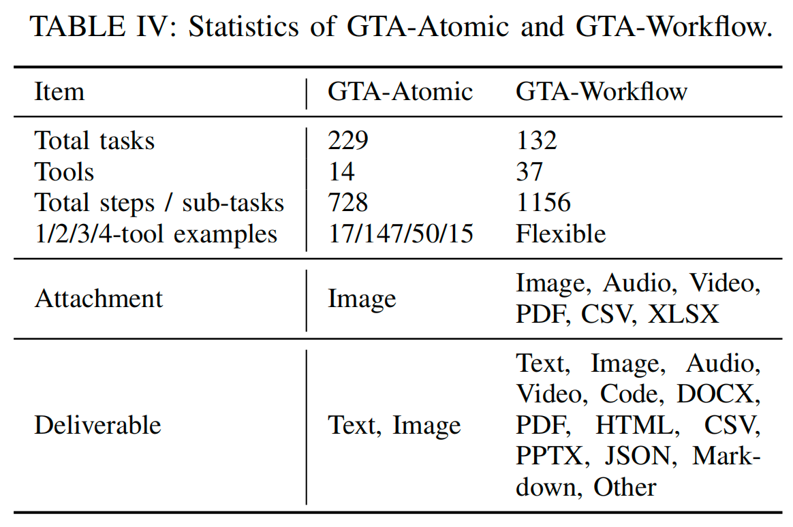
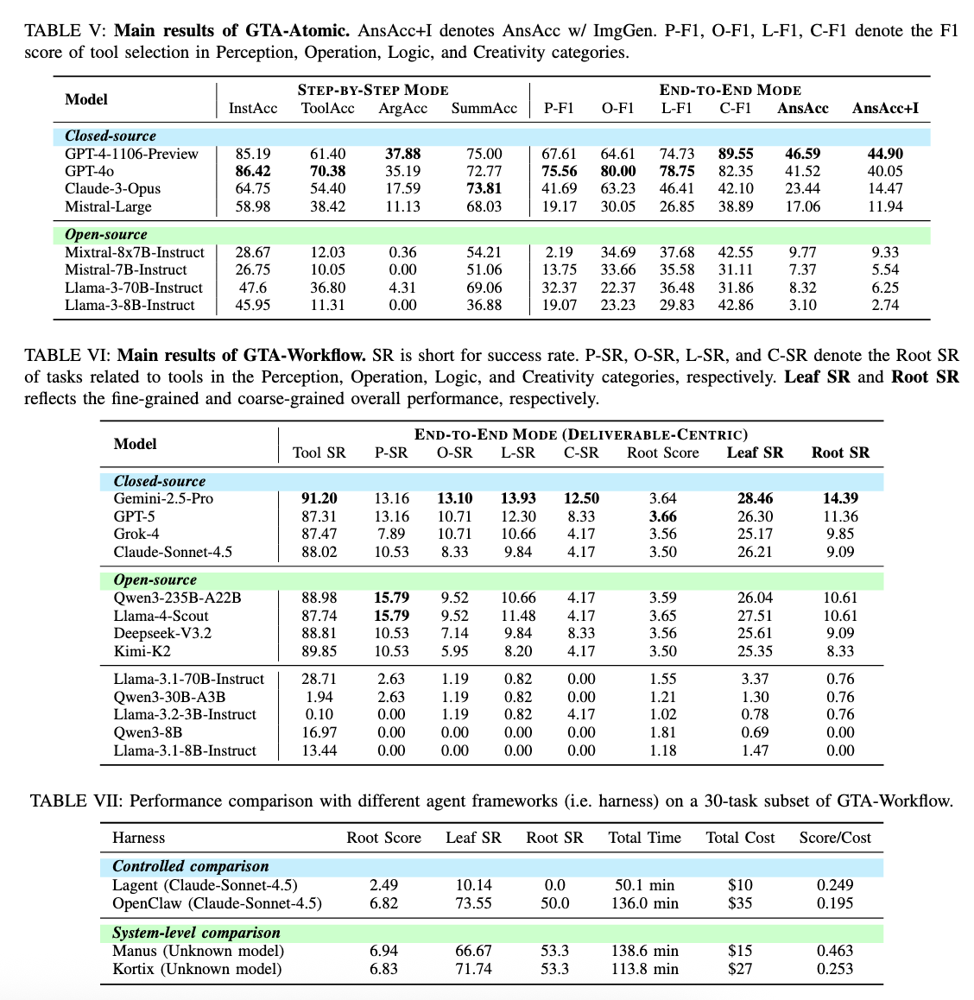

# GTA: General Tool Agent Benchmark and Evaluation Framework  
### [[NeurIPS 2024 D&B] GTA: A Benchmark for General Tool Agents](https://proceedings.neurips.cc/paper_files/paper/2024/file/8a75ee6d4b2eb0b777f549a32a5a5c28-Paper-Datasets_and_Benchmarks_Track.pdf)
### [[arXiv 2026] GTA-2: Benchmarking General Tool Agents from Atomic Tool-Use to Open-Ended Workflows](https://arxiv.org/pdf/2604.15715)
<div align="center">

⬇️ Download Dataset Here:
[[GTA-Atomic](https://github.com/open-compass/GTA/releases/download/v0.1.0/gta_dataset.zip)]
[[GTA-Workflow]()]
</div>

## 🌟 Introduction

GTA-2 is a benchmark and evaluation kit for **General Tool Agents**, designed to bridge **atomic tool-use evaluation** and **open-ended workflow evaluation** in one repository.

### Benchmark hierarchy

- **GTA-Workflow**: the new focus of GTA-2, for long-horizon, open-ended workflow evaluation.
- **GTA-Atomic**: the original GTA benchmark for short-horizon atomic tool-use tasks. Please refer to [README_GTA-1.md](README_GTA-1.md).

This readme is centered around **GTA-Workflow**, which targets realistic long-horizon tasks with open-ended deliverables. Compared with traditional benchmark-style evaluation, GTA-Workflow focuses more on **what an agent can finally accomplish in a complete workflow**, rather than only whether it predicts the next tool call correctly.

### What this repo supports

- **Workflow-oriented agent evaluation.**  
  Evaluate long-horizon, open-ended agent tasks with deliverable-centric scoring.

- **Both model and harness evaluation.**  
  GTA-Workflow is designed to evaluate not only the underlying LLM, but also the **execution harness / agent framework** behind it.

- **Default OpenCompass-based evaluation.**  
  We provide a standard evaluation pipeline based on **[OpenCompass](https://github.com/open-compass/opencompass) + [Lagent](https://github.com/InternLM/lagent)**, suitable for agents integrated as callable frameworks.

- **Custom agent / custom LLM integration.**  
  Beyond the default setup, users can plug in their own agent framework or LLM backend. See [docs/ADDING_NEW_AGENT_OR_LLM.md](docs/ADDING_NEW_AGENT_OR_LLM.md).

- **End-to-end evaluation without OpenCompass.**  
  For agent products or closed systems that cannot be directly integrated into our framework, GTA-2 also supports evaluating **final execution results directly**, enabling assessment of systems such as **Manus, Kortix, or OpenClaw**.


<div align="center">
 
</div>


## 📣 What's New
- **[2026.4.20]** Release GTA-2 paper and GTA-Workflow dataset. 🔥🔥🔥
- **[2026.4.12]** Release **GTA-2**, extending the original GTA benchmark into a **hierarchical evaluation repo** with:
  - **GTA-Workflow** for long-horizon, open-ended workflow evaluation in productivity scenarios,
  - support for evaluating both **LLM capability (GPT, Gemini, Claude, etc.)** and **agent execution harnesses (OpenClaw, Manus, Kortix, etc.)**,
  - support for both **OpenCompass-based agent evaluation** and **end-to-end result evaluation** for external/closed agent systems.
- **[2026.2.14]** Update 🏆Leaderboard, Feb. 2026, including new models such as GPT-5, Gemini-2.5, Claude-4.5, Kimi-K2, Grok-4, Llama-4, Deepseek-V3.2, Qwen3-235B-A22B series.
- **[2025.3.25]** Update 🏆Leaderboard, Mar. 2025, including new models such as Deepseek-R1, Deepseek-V3, Qwen-QwQ, Qwen-2.5-max series.
- **[2024.9.26]** GTA is accepted to NeurIPS 2024 Dataset and Benchmark Track! 🎉🎉🎉
- **[2024.7.11]** Paper available on arXiv. ✨✨✨
- **[2024.7.3]** Release the evaluation and tool deployment code of GTA. 🔥🔥🔥
- **[2024.7.1]** Release the GTA dataset on Hugging Face. 🎉🎉🎉

## 📚 Dataset Statistics

### GTA-Workflow: Real-World Productivity Tasks
GTA-Workflow focuses on **long-horizon, open-ended productivity scenarios**, where agents are required to complete realistic deliverables instead of predicting intermediate tool calls.

These tasks cover diverse real-world use cases, including 
- Data Analysis
- Education & Instruction
- Planning & Decision
- Creative Design
- Marketing Strategy
- Retrieval & QA

Compared to GTA-Atomic, GTA-Workflow significantly expands modalities, tool ecosystem, and task complexity.

<div align="center">
 
</div>

<!-- The detailed information of extended tools are shown in the table below.-->

<div align="center">
 
</div> 

### Data Sources

Unlike GTA-Atomic (original GTA), which is manually constructed for controlled evaluation, GTA-Workflow is built from **real-world workflow tasks** with a human-in-the-loop pipeline. The tasks are collected and rewritten from two major sources:

- Agent platforms and systems, including [Manus](https://manus.im/), [Kortix](http://kortix.com/), [Flowith](https://flowith.io/), [Minimax Agent](https://agent.minimax.io/), and [CrewAI](https://crewai.com/).
- Real user needs from online communities, including [Reddit](https://www.reddit.com/) and [Stack Exchange](https://stackexchange.com/).


## 🏆 Leaderboard, Apr. 2026

Main evaluation results of both LLMs and agent harness **GTA-2**.

<div align="center">
 
</div> 


## 🚀 How to Evaluate on GTA-2

GTA-2 supports three evaluation modes depending on your setup.

- **Default OpenCompass-based evaluation.**  
  We provide a standard pipeline based on **OpenCompass + Lagent**, suitable for agents that can be integrated as callable frameworks. The following instructions in this section focus on this setup.

- **Custom agent / custom LLM integration.**  
  You can plug in your own agent framework or LLM backend via a wrapper.  
  See [docs/ADDING_NEW_AGENT_OR_LLM.md](docs/ADDING_NEW_AGENT_OR_LLM.md).

- **End-to-end evaluation without OpenCompass.**  
  For external or productized agent systems where only final outputs are available, GTA-2 supports evaluating results directly (e.g., Manus-, Kortix-, or OpenClaw-style systems).  
  See [agent_app_eval/README.md](agent_app_eval/README.md).

The following instructions focus on **GTA-Workflow** evaluation of default setup.
For **GTA-Atomic (original GTA)** evaluation, please refer to  
[README_GTA1.md](README_GTA1.md). The codebase remains compatible.

### Prepare GTA-2 Dataset
1. Clone this repo.
```shell
git clone https://github.com/open-compass/GTA.git
cd GTA
```
2. Download the dataset from [release file](https://github.com/open-compass/GTA/releases/latest/download/gta_dataset_v2.zip).
```shell
mkdir ./opencompass/data
```
Put it under the folder ```./opencompass/data/```. The structure of files should be:
```
GTA/
├── agentlego
├── opencompass
│   ├── data
│   │   ├── gta_dataset_v2
│   ├── ...
├── ...
```

### Prepare Your Model
1. Download the model weights.
```shell
pip install -U huggingface_hub
# huggingface-cli download --resume-download hugging/face/repo/name --local-dir your/local/path --local-dir-use-symlinks False
huggingface-cli download --resume-download Qwen/Qwen1.5-7B-Chat --local-dir ~/models/qwen1.5-7b-chat --local-dir-use-symlinks False
```
2. Install [LMDeploy](https://github.com/InternLM/lmdeploy).
```shell
conda create -n lmdeploy python=3.10
conda activate lmdeploy
```
For CUDA 12:
```shell
pip install lmdeploy
```
For CUDA 11+:
```shell
export LMDEPLOY_VERSION=0.4.0
export PYTHON_VERSION=310
pip install https://github.com/InternLM/lmdeploy/releases/download/v${LMDEPLOY_VERSION}/lmdeploy-${LMDEPLOY_VERSION}+cu118-cp${PYTHON_VERSION}-cp${PYTHON_VERSION}-manylinux2014_x86_64.whl --extra-index-url https://download.pytorch.org/whl/cu118
```
3. Launch a model service.
```shell
# lmdeploy serve api_server path/to/your/model --server-port [port_number] --model-name [your_model_name]
lmdeploy serve api_server ~/models/qwen1.5-7b-chat --server-port 12580 --model-name qwen1.5-7b-chat
```
### Deploy Tools
1. Install [AgentLego](https://github.com/InternLM/agentlego).
```shell
conda create -n agentlego python=3.11.9
conda activate agentlego
cd agentlego
pip install -r requirements_all.txt
pip install -r requirements_gta_v2.txt
pip install agentlego
pip install -e .
mim install mmengine
mim install mmcv==2.1.0
```
Open ```~/anaconda3/envs/agentlego/lib/python3.11/site-packages/transformers/modeling_utils.py```, then set ```_supports_sdpa = False``` to ```_supports_sdpa = True``` in line 1279.

2. Deploy tools for GTA benchmark.

To use the GoogleSearch and MathOCR tools, you should first get the Serper API key from https://serper.dev, and the Mathpix API key from https://mathpix.com/. Then export these keys as environment variables.

```shell
export SERPER_API_KEY='your_serper_key_for_google_search_tool'
export MATHPIX_APP_ID='your_mathpix_key_for_mathocr_tool'
export MATHPIX_APP_KEY='your_mathpix_key_for_mathocr_tool'
```

Start the tool server.

```shell
agentlego-server start --port 16181 --extra ./benchmark.py  `cat benchmark_toollist_v2.txt` --host 0.0.0.0
```
### Start Evaluation
1. Install [OpenCompass](https://github.com/open-compass/opencompass).
```shell
conda create --name opencompass python=3.10 pytorch torchvision pytorch-cuda -c nvidia -c pytorch -y
conda activate opencompass
cd agentlego
pip install -e .
cd ../opencompass
pip install -e .
pip install huggingface_hub==0.25.2 transformers==4.40.1
```
2. Modify the config file at ```configs/eval_gta_bench_v2.py``` as below.

The ip and port number of **openai_api_base** is the ip of your model service and the port number you specified when using lmdeploy.

The ip and port number of **tool_server** is the ip of your tool service and the port number you specified when using agentlego.

```python
models = [
  dict(
        abbr='qwen1.5-7b-chat',
        type=LagentAgent,
        agent_type=ReAct,
        max_turn=10,
        llm=dict(
            type=OpenAI,
            path='qwen1.5-7b-chat',
            key='EMPTY',
            openai_api_base='http://10.140.1.17:12580/v1/chat/completions',
            query_per_second=1,
            max_seq_len=4096,
            stop='<|im_end|>',
        ),
        tool_server='http://10.140.0.138:16181',
        tool_meta='data/gta_dataset_v2/toolmeta.json',
        batch_size=8,
    ),
]
```

Before running, set:

```shell
export OPENCOMPASS_TOOLMETA_PATH=data/gta_dataset_v2/toolmeta.json
export OPENAI_API_KEY=your_openai_key
```

3. Infer and evaluate with OpenCompass.
```shell
# infer only
python run.py configs/eval_gta_bench_v2.py --max-num-workers 32 --debug --mode infer
```
```shell
# evaluate only
python run.py configs/eval_gta_bench_v2.py --max-num-workers 32 --debug --reuse [time_stamp_of_prediction_file] --mode eval
```
```shell
# infer and evaluate
python run.py configs/eval_gta_bench_v2.py -p llmit -q auto --max-num-workers 32 --debug
```


# 📝 Citation
If you use GTA in your research, please cite the following paper:
```bibtex
@misc{wang2024gtabenchmarkgeneraltool,
      title={GTA: A Benchmark for General Tool Agents}, 
      author={Jize Wang and Zerun Ma and Yining Li and Songyang Zhang and Cailian Chen and Kai Chen and Xinyi Le},
      year={2024},
      eprint={2407.08713},
      archivePrefix={arXiv},
      primaryClass={cs.CL},
      url={https://arxiv.org/abs/2407.08713}, 
}
```

