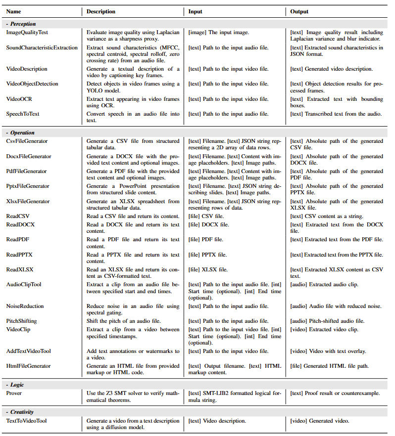

# GTA-2: Benchmarking General Tool Agents from Atomic Tool-Use to Open-Ended Workflows

<div align="center">

[⬇️ [Dataset](https://github.com/open-compass/GTA/releases/latest/download/gta_dataset_v2.zip)]
[📃 [Paper](https://arxiv.org/abs/2407.08713)]
[🌐 [Project Page](https://open-compass.github.io/GTA/)]
[🤗 [Hugging Face](https://huggingface.co/datasets/Jize1/GTA)]
[🏆 [Newest Leaderboard](#-leaderboard-apr-2026)]
</div>

## 🌟 Introduction

>The development of general-purpose agents requires a shift from executing simple instructions to completing complex, real-world productivity workflows. However, current tool-use benchmarks remain misaligned with real-world requirements, relying on AI-generated queries, dummy tools, and limited system-level coordination.

GTA-2 is a hierarchical benchmark for General Tool Agents (GTA) spanning atomic tool use and open-ended workflows. Built on real-world authenticity, it leverages real user queries, deployed tools, and multimodal contexts. 

- GTA-Atomic, inherited from our prior GTA benchmark, evaluates short-horizon, closed-ended tool-use precision. [README_GTA1.md](README_GTA1.md)

- GTA-Workflow introduces long-horizon, open-ended tasks for realistic end-to-end completion.

<div align="center">
 
</div>


## 📣 What's New

- **[2026.4.12]** Release GTA-2 (GTA-Atomic + GTA-Workflow). 🔥🔥🔥
- **[2026.2.14]** Update 🏆Leaderboard, Feb. 2026, including new models such as GPT-5, Gemini-2.5, Claude-4.5, Kimi-K2, Grok-4, Llama-4, Deepseek-V3.2, Qwen3-235B-A22B series.
- **[2025.3.25]** Update 🏆Leaderboard, Mar. 2025, including new models such as Deepseek-R1, Deepseek-V3, Qwen-QwQ, Qwen-2.5-max series.
- **[2024.9.26]** GTA is accepted to NeurIPS 2024 Dataset and Benchmark Track! 🎉🎉🎉
- **[2024.7.11]** Paper available on arXiv. ✨✨✨
- **[2024.7.3]** Release the evaluation and tool deployment code of GTA. 🔥🔥🔥
- **[2024.7.1]** Release the GTA dataset on Hugging Face. 🎉🎉🎉

## 📚 Dataset Statistics
GTA-2 integrates GTA-Atomic and GTA-Workflow into a hierarchical benchmark spanning structured atomic tool use and open-ended workflow completion.

<div align="center">
 
</div>

The detailed information of extended tools are shown in the table below.

<div align="center">
 
</div>


## 🏆 Leaderboard, Apr. 2026

Main results of **GTA-Workflow**.

SR is short for success rate. P-SR, O-SR, L-SR, and C-SR denote the **Root SR** of tasks related to tools in the Perception, Operation, Logic, and Creativity categories, respectively. **Leaf SR** and **Root SR** reflect the fine-grained and coarse-grained overall performance, respectively.

| Model | Tool SR | P-SR | O-SR | L-SR | C-SR | Root Score | **Leaf SR** | **Root SR** |
|---|---:|---:|---:|---:|---:|---:|---:|---:|
| **Closed-source** |  |  |  |  |  |  |  |  |
| Gemini-2.5-Pro | **91.20** | 13.16 | **13.10** | **13.93** | **12.50** | 3.64 | **28.46** | **14.39** |
| GPT-5 | 87.31 | 13.16 | 10.71 | 12.30 | 8.33 | **3.66** | 26.30 | 11.36 |
| Grok-4 | 87.47 | 7.89 | 10.71 | 10.66 | 4.17 | 3.56 | 25.17 | 9.85 |
| Claude-Sonnet-4.5 | 88.02 | 10.53 | 8.33 | 9.84 | 4.17 | 3.50 | 26.21 | 9.09 |
| **Open-source** |  |  |  |  |  |  |  |  |
| Qwen3-235B-A22B | 88.98 | **15.79** | 9.52 | 10.66 | 4.17 | 3.59 | 26.04 | 10.61 |
| Llama-4-Scout | 87.74 | **15.79** | 9.52 | 11.48 | 4.17 | 3.65 | 27.51 | 10.61 |
| Deepseek-V3.2 | 88.81 | 10.53 | 7.14 | 9.84 | 8.33 | 3.56 | 25.61 | 9.09 |
| Kimi-K2 | 89.85 | 10.53 | 5.95 | 8.20 | 4.17 | 3.50 | 25.35 | 8.33 |
| Llama-3.1-70B-Instruct | 28.71 | 2.63 | 1.19 | 0.82 | 0.00 | 1.55 | 3.37 | 0.76 |
| Qwen3-30B-A3B | 1.94 | 2.63 | 1.19 | 0.82 | 0.00 | 1.21 | 1.30 | 0.76 |
| Llama-3.2-3B-Instruct | 0.10 | 0.00 | 1.19 | 0.82 | 4.17 | 1.02 | 0.78 | 0.76 |
| Qwen3-8B | 16.97 | 0.00 | 0.00 | 0.00 | 0.00 | 1.81 | 0.69 | 0.00 |
| Llama-3.1-8B-Instruct | 13.44 | 0.00 | 0.00 | 0.00 | 0.00 | 1.18 | 1.47 | 0.00 |


## 🚀 Evaluate on GTA-2

If you want to add a new agent wrapper or integrate a different LLM endpoint, see more details at:

- [ADDING_NEW_AGENT_OR_LLM.md](docs/ADDING_NEW_AGENT_OR_LLM.md)

For **GTA-Atomic (old version GTA)** evaluation, please directly refer to **[README_GTA1.md](README_GTA1.md)**.

For an **Agent App Eval** example (evaluate any external agent app by converting its outputs into an eval-pack, then scoring with the repo-local GTA-Workflow evaluator), see **[agent_app_eval/README.md](agent_app_eval/README.md)**.

The following instructions focus on **GTA-Workflow**.

### Prepare GTA-2 Dataset
1. Clone this repo.
```shell
git clone https://github.com/open-compass/GTA.git
cd GTA
```
2. Download the dataset from [release file](https://github.com/open-compass/GTA/releases/latest/download/gta_dataset_v2.zip).
```shell
mkdir ./opencompass/data
```
Put it under the folder ```./opencompass/data/```. The structure of files should be:
```
GTA/
├── agentlego
├── opencompass
│   ├── data
│   │   ├── gta_dataset_v2
│   ├── ...
├── ...
```

### Prepare Your Model
1. Download the model weights.
```shell
pip install -U huggingface_hub
# huggingface-cli download --resume-download hugging/face/repo/name --local-dir your/local/path --local-dir-use-symlinks False
huggingface-cli download --resume-download Qwen/Qwen1.5-7B-Chat --local-dir ~/models/qwen1.5-7b-chat --local-dir-use-symlinks False
```
2. Install [LMDeploy](https://github.com/InternLM/lmdeploy).
```shell
conda create -n lmdeploy python=3.10
conda activate lmdeploy
```
For CUDA 12:
```shell
pip install lmdeploy
```
For CUDA 11+:
```shell
export LMDEPLOY_VERSION=0.4.0
export PYTHON_VERSION=310
pip install https://github.com/InternLM/lmdeploy/releases/download/v${LMDEPLOY_VERSION}/lmdeploy-${LMDEPLOY_VERSION}+cu118-cp${PYTHON_VERSION}-cp${PYTHON_VERSION}-manylinux2014_x86_64.whl --extra-index-url https://download.pytorch.org/whl/cu118
```
3. Launch a model service.
```shell
# lmdeploy serve api_server path/to/your/model --server-port [port_number] --model-name [your_model_name]
lmdeploy serve api_server ~/models/qwen1.5-7b-chat --server-port 12580 --model-name qwen1.5-7b-chat
```
### Deploy Tools
1. Install [AgentLego](https://github.com/InternLM/agentlego).
```shell
conda create -n agentlego python=3.11.9
conda activate agentlego
cd agentlego
pip install -r requirements_all.txt
pip install -r requirements_gta_v2.txt
pip install agentlego
pip install -e .
mim install mmengine
mim install mmcv==2.1.0
```
Open ```~/anaconda3/envs/agentlego/lib/python3.11/site-packages/transformers/modeling_utils.py```, then set ```_supports_sdpa = False``` to ```_supports_sdpa = True``` in line 1279.

2. Deploy tools for GTA benchmark.

To use the GoogleSearch and MathOCR tools, you should first get the Serper API key from https://serper.dev, and the Mathpix API key from https://mathpix.com/. Then export these keys as environment variables.

```shell
export SERPER_API_KEY='your_serper_key_for_google_search_tool'
export MATHPIX_APP_ID='your_mathpix_key_for_mathocr_tool'
export MATHPIX_APP_KEY='your_mathpix_key_for_mathocr_tool'
```

Start the tool server.

```shell
agentlego-server start --port 16181 --extra ./benchmark.py  `cat benchmark_toollist_v2.txt` --host 0.0.0.0
```
### Start Evaluation
1. Install [OpenCompass](https://github.com/open-compass/opencompass).
```shell
conda create --name opencompass python=3.10 pytorch torchvision pytorch-cuda -c nvidia -c pytorch -y
conda activate opencompass
cd agentlego
pip install -e .
cd ../opencompass
pip install -e .
pip install huggingface_hub==0.25.2 transformers==4.40.1
```
2. Modify the config file at ```configs/eval_gta_bench_v2.py``` as below.

The ip and port number of **openai_api_base** is the ip of your model service and the port number you specified when using lmdeploy.

The ip and port number of **tool_server** is the ip of your tool service and the port number you specified when using agentlego.

```python
models = [
  dict(
        abbr='qwen1.5-7b-chat',
        type=LagentAgent,
        agent_type=ReAct,
        max_turn=10,
        llm=dict(
            type=OpenAI,
            path='qwen1.5-7b-chat',
            key='EMPTY',
            openai_api_base='http://10.140.1.17:12580/v1/chat/completions',
            query_per_second=1,
            max_seq_len=4096,
            stop='<|im_end|>',
        ),
        tool_server='http://10.140.0.138:16181',
        tool_meta='data/gta_dataset_v2/toolmeta.json',
        batch_size=8,
    ),
]
```

Before running, set:

```shell
export OPENCOMPASS_TOOLMETA_PATH=data/gta_dataset_v2/toolmeta.json
export OPENAI_API_KEY=your_openai_key
```

3. Infer and evaluate with OpenCompass.
```shell
# infer only
python run.py configs/eval_gta_bench_v2.py --max-num-workers 32 --debug --mode infer
```
```shell
# evaluate only
python run.py configs/eval_gta_bench_v2.py --max-num-workers 32 --debug --reuse [time_stamp_of_prediction_file] --mode eval
```
```shell
# infer and evaluate
python run.py configs/eval_gta_bench_v2.py -p llmit -q auto --max-num-workers 32 --debug
```


# 📝 Citation
If you use GTA in your research, please cite the following paper:
```bibtex
@misc{wang2024gtabenchmarkgeneraltool,
      title={GTA: A Benchmark for General Tool Agents}, 
      author={Jize Wang and Zerun Ma and Yining Li and Songyang Zhang and Cailian Chen and Kai Chen and Xinyi Le},
      year={2024},
      eprint={2407.08713},
      archivePrefix={arXiv},
      primaryClass={cs.CL},
      url={https://arxiv.org/abs/2407.08713}, 
}
```

